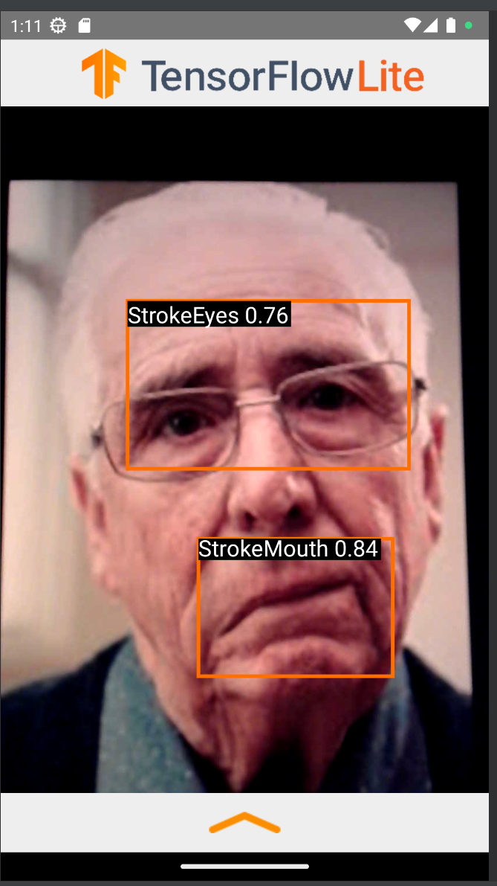
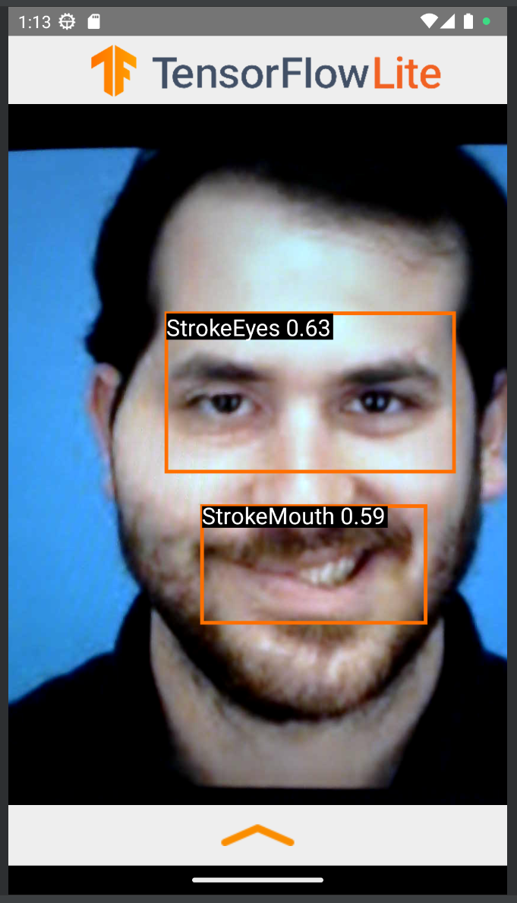
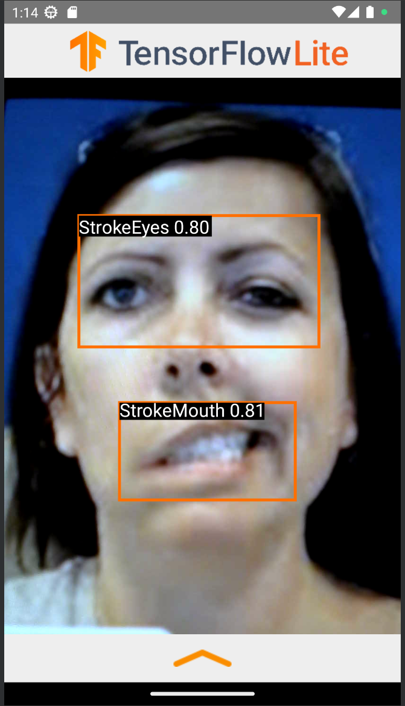

# TensorFlow Lite Object Detection Android Demo

### Overview

This is a camera app that detects visual stroke symptoms in patients of 3 classes:
1. StrokeEyes
2. StrokeMouth
3. StrokeJaw

Model trained on the [Stroke Faces Dataset](https://kaggle.com/datasets/kaitavmehta/facial-droop-and-facial-paralysis-image). .

This application should be run on a physical Android device.

## Build the demo using Android Studio

### Prerequisites

*   The **[Android Studio](https://developer.android.com/studio/index.html)**
    IDE. This sample has been tested on Android Studio Bumblebee.

*   A physical Android device with a minimum OS version of SDK 24 (Android 7.0 -
    Nougat) with developer mode enabled. The process of enabling developer mode
    may vary by device.

### Building

*   Open Android Studio. From the Welcome screen, select Open an existing
    Android Studio project.

*   From the Open File or Project window that appears, navigate to and select
    the tensorflow-lite/examples/object_detection/android directory. Click OK.

*   If it asks you to do a Gradle Sync, click OK.

*   With your Android device connected to your computer and developer mode
    enabled, click on the green Run arrow in Android Studio.
